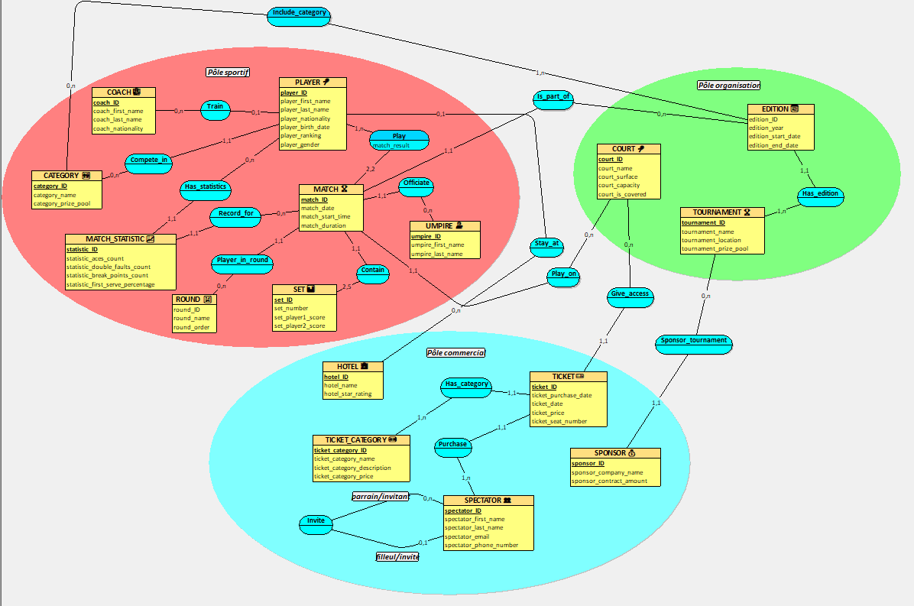

# TI404I_ProjectDB_Gastaldo_Rubem
# Roland-Garros Tournament Management System
 
## 👥 Team Members
- **Raphael GASTALDO**
- **Adrian RUBEM**
 
**Course:** TI404 - Databases 1  
**Instructor:** Lena TREBAUL/Amir CHACHAOUI  
**Deadline:** February 27, 2026
 
---
 
## 🎯 Project Overview
 
Database design for Roland-Garros tennis tournament management using the MERISE methodology.
 
**Scope:**
- Sports: Players, matches, statistics
- Commercial: Tickets, spectators, sponsors
- Organizational: Courts, tournament editions
 
---
 
## 📋 Part 1: Requirements Analysis & MCD
 
### 1. Domain Selection
 
**Domain:** Professional Tennis Tournament Management  
**Organization:** French Tennis Federation (FFT)  
**Tournament:** Roland-Garros Grand Slam
 
---
 
### 2. Requirements Analysis
 
#### 2.1 Prompt Used
 
Full prompt: [`prompts/prompt_analyse_besoins.txt`](prompts/prompt_analyse_besoins.txt)
 
We used the RICARDO framework to query an AI assistant (Claude) for business requirements.
 
#### 2.2 AI Response
 
Full response: [`prompts/ia_response.txt`](prompts/ia_response.txt)
 
---
 
### 3. Business Rules
 
1. Each player must be registered with a unique identification number and have an official ATP or WTA ranking
2. A player can only participate in one category during the tournament (either Men's Singles or Women's Singles)
3. Each match must be played on exactly one court at a specific date and time
4. A court can host multiple matches throughout the tournament but only one match at a time
5. Each match is officiated by one chair umpire and multiple line judges
6. A match consists of a minimum of 2 sets and maximum of 5 sets for men, and 2 to 3 sets for women
7. Each player may have one registered coach who can accompany them during the tournament
8. Tournament progresses through defined phases: Qualifications, Round 1, Round 2, Round 3, Round of 16, Quarterfinals, Semifinals, and Finals
9. A player advances to the next round only by winning their current round match
10. Courts are characterized by surface type (all clay for Roland-Garros), capacity, and whether they are covered or open-air
11. Spectators must purchase tickets for specific dates and court sessions
12. Tickets are categorized by access type: VIP lounges, Tribune seats, or General lawn access
13. Each spectator ticket is valid for one specific date and grants access to specific courts
14. Sponsors have contracts specifying their sponsorship level and visibility benefits
15. Prize money is distributed according to the round reached by each player
16. Players are accommodated in partner hotels with pre-negotiated rates
17. Match statistics (aces, double faults, break points) are recorded for each set of every match
18. An umpire can officiate multiple matches but not simultaneously
19. Each tournament edition has a fixed total prize pool that is distributed among participants
20. Player rankings may change after the tournament based on their performance
 
---
 
### 4. Data Dictionary
 
| Meaning of the Data | Type | Size |
|---------------------|------|------|
| Player identification number | INTEGER | 10 |
| Player first name | TEXT | 50 |
| Player last name | TEXT | 50 |
| Player nationality | TEXT | 3 |
| Player date of birth | DATE | 10 |
| Player ATP/WTA ranking | INTEGER | 5 |
| Player gender | TEXT | 1 |
| Match identification number | INTEGER | 10 |
| Match date | DATE | 10 |
| Match start time | TIME | 8 |
| Match duration in minutes | INTEGER | 4 |
| Court identification number | INTEGER | 5 |
| Court name | TEXT | 50 |
| Court surface type | TEXT | 20 |
| Court capacity | INTEGER | 6 |
| Court covered status | BOOLEAN | 1 |
| Set number | INTEGER | 1 |
| Set score player 1 | INTEGER | 2 |
| Set score player 2 | INTEGER | 2 |
| Umpire identification number | INTEGER | 10 |
| Umpire first name | TEXT | 50 |
| Umpire last name | TEXT | 50 |
| Umpire certification level | TEXT | 20 |
| Coach identification number | INTEGER | 10 |
| Coach first name | TEXT | 50 |
| Coach last name | TEXT | 50 |
| Round name | TEXT | 30 |
| Tournament year | INTEGER | 4 |
| Total prize pool | DECIMAL | 12 |
| Prize amount by round | DECIMAL | 10 |
| Ticket identification number | INTEGER | 10 |
| Ticket category | TEXT | 20 |
| Ticket price | DECIMAL | 8 |
| Spectator email | TEXT | 100 |
| Sponsor company name | TEXT | 100 |
| Sponsorship contract amount | DECIMAL | 12 |
 
**Total: 35 data items**
 
---
 
### 5. Conceptual Data Model (MCD)
 

 
**Source file:** [`mcd/roland_garros_orga.loo`](mcd/RolandGarros_MCD.loo)
 
#### MCD Statistics
 
- **Entities:** 16
- **Attributes:** 67
- **Relationships:** 18
- **Normalization:** 3NF
 
#### Entities by Domain
 
**Sports (8):** PLAYER, MATCH, SET, UMPIRE, COACH, ROUND, CATEGORY, MATCH_STATISTIC
 
**Commercial (5):** SPECTATOR, TICKET, TICKET_CATEGORY, SPONSOR, HOTEL
 
**Organizational (3):** TOURNAMENT, EDITION, COURT
 
#### Advanced Modeling Elements
 
**1. Weak Entity:** SET depends on MATCH
- A set cannot exist without its parent match
- Relationship: MATCH **contains** SET (1,1 ↔ 1,n)
 
**2. Recursive Relationship:** SPECTATOR invites SPECTATOR
- Represents a referral/sponsorship program
- Cardinalities: 0,n (referrer) ↔ 0,1 (referred)
 
---
 
## 📁 Project Structure

```
TI404I_ProjectDB_Gastaldo_Rubem/
├── README.md
├── LDM_RolandGarros.docx          # Logical Data Model
├── Mini-Project_1_EN.pdf          # Part 1 deliverable
├── Mini_Project2_EN.pdf           # Part 2 deliverable
├── prompts/
│   ├── prompt_analyse_besoins.txt # MERISE analysis prompt (RICARDO framework)
│   ├── ia_response.txt            # AI-generated business rules & data dictionary
│   └── prompt_insertion.txt       # Prompt used to generate sample data
├── mcd/
│   ├── RolandGarros_MCD.loo       # Looping source file
│   └── mcd_image.png              # MCD diagram export
└── scripts/
    ├── 1_creation.sql             # DDL - table definitions & foreign keys
    ├── 2_contraintes.sql          # CHECK constraints (ALTER TABLE)
    ├── 3_insertion.sql            # Sample data (~590 rows across all 18 tables)
    └── 4_interrogation.sql        # 20 queries + 4 bonus analytical queries
```
 
---
 
## Part 2: Logical Data Model & SQL Implementation

### Logical Data Model (LDM)

Full document: [`LDM_RolandGarros.docx`](LDM_RolandGarros.docx)

### Running the Database

Execute the scripts **in order**:

```bash
# MySQL
mysql -u <user> -p <database> < scripts/1_creation.sql
mysql -u <user> -p <database> < scripts/2_contraintes.sql
mysql -u <user> -p <database> < scripts/3_insertion.sql
mysql -u <user> -p <database> < scripts/4_interrogation.sql

# PostgreSQL
psql -U <user> -d <database> -f scripts/1_creation.sql
psql -U <user> -d <database> -f scripts/2_contraintes.sql
psql -U <user> -d <database> -f scripts/3_insertion.sql
psql -U <user> -d <database> -f scripts/4_interrogation.sql
```

### `1_creation.sql` - DDL

Creates all 18 tables with primary keys, foreign keys, and referential integrity:
- `CASCADE` on delete for weak entities (SET → MATCH, EDITION → TOURNAMENT)
- `SET NULL` for optional relationships (PLAYER → COACH, PLAYER → HOTEL)
- `RESTRICT` for business-critical references (MATCH → UMPIRE, MATCH → COURT)

### `2_contraintes.sql` - 15 CHECK Constraints

| # | Table | Constraint |
|---|-------|------------|
| 1 | player | `player_gender IN ('M', 'F')` |
| 2 | player | `player_ranking > 0` |
| 3 | player | `LENGTH(player_nationality) = 3` |
| 4 | set | scores between 0 and 7 |
| 5 | set | `set_number` between 1 and 5 |
| 6 | court | `court_capacity > 0` |
| 7 | court | `court_surface IN ('Clay', 'Hard', 'Grass', 'Carpet')` |
| 8 | hotel | `hotel_star_rating` between 1 and 5 |
| 9 | match | `match_duration > 0` |
| 10 | match_statistic | `statistic_first_serve_percentage` between 0 and 100 |
| 11 | match_statistic | `statistic_aces_count >= 0` |
| 12 | ticket | `ticket_price > 0` |
| 13 | edition | `edition_end_date > edition_start_date` |
| 14 | play | `match_result IN ('Winner', 'Loser')` |
| 15 | category | `category_prize_pool > 0` |

### `3_insertion.sql` - Sample Data (~590 rows, 2 editions)

| Table | Records | Table | Records |
|-------|---------|-------|---------|
| tournament | 1 | edition | 2 |
| category | 5 | player | 40 (20M + 20F) |
| coach | 20 | sponsor | 5 |
| hotel | 5 | spectator | 80 (20% with referrer) |
| umpire | 15 | match | 30 |
| round | 7 | ticket | 150 |
| court | 5 | include_category | 10 |
| ticket_category | 4 | play | 60 (2/match) |
| | | set | 90 (~3/match) |
| | | match_statistic | 60 (2/match) |

### `4_interrogation.sql` - Queries (20 + 4 bonus)

| Category | Queries |
|----------|---------|
| Projections & Selections | Q1–Q5 |
| Aggregations | Q6–Q10 |
| Joins | Q11–Q15 |
| Subqueries | Q16–Q20 |
| Bonus — Tournament Director scenario | B1–B4 |

---

## 🔧 Tools Used

- **Looping** - MCD modeling (MERISE)
- **Claude (Anthropic)** - Requirements analysis, project overview with CLAUDE.md and assistant for file 4 (RICARDO framework)
- **MySQL / PostgreSQL** - SQL execution
- **Git/GitHub** - Version control
 
---
 
## 📚 References
 
- [Roland-Garros Official Website](https://www.rolandgarros.com)
- [ATP Tour](https://www.atptour.com)
- [WTA Tennis](https://www.wtatennis.com)
- [French Tennis Federation](https://www.fft.fr)
